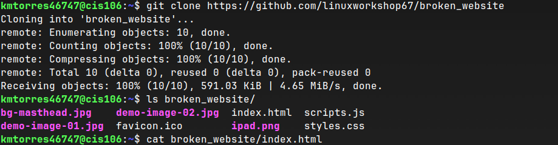
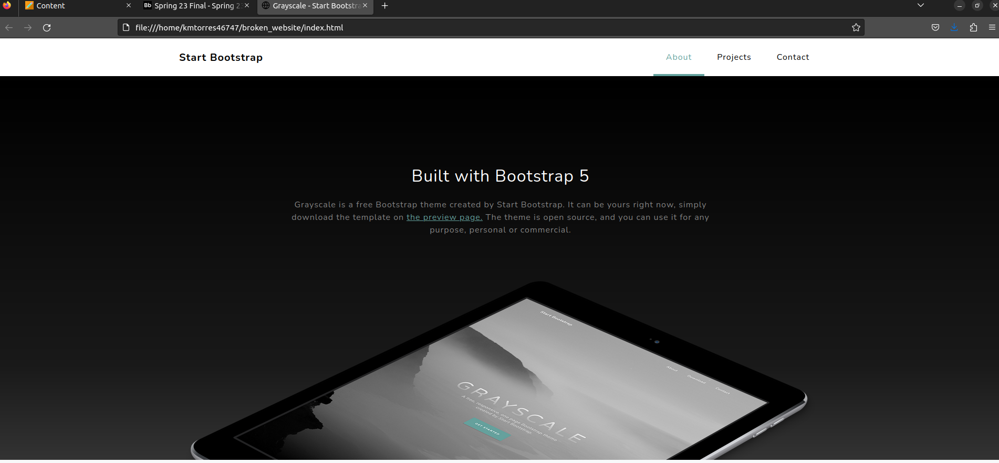

# Final Exam Submission

## Q1
### Note: I did not look at the photos closely and realize the other subdirectories but I managed to fix it at the end.
 
 
 

## Q2
### Step 1 and 2
 
### Step 3
 
### Step 4 and 5
 
### Step 6 and 7
 
### Step 7 cont.
 
### Step 8, 9, 10
 
### Step 10 cont.
 

## Q3
 
 
 
 
 
 
 