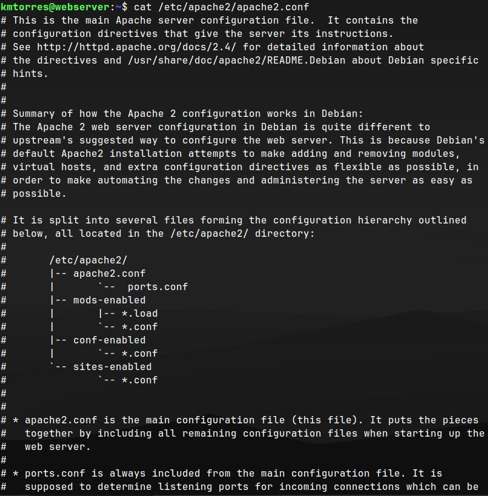

# Deliverable 2 Submission

## Question 1
### Screenshot of hardware information.

### Screenshot of CPUs.

## Question 2
### Screenshot of login screen of the server right after logging in.

## Question 3
### Screenshot of connecting to the server with ssh from Ubuntu Desktop.

## Question 4
### Screenshot of using command `systemctl status apache2 --no-pager`

### Screenshot of using command `systemctl status sshd --no-pager`

### Screenshot of using command `systemctl status ufw --no-pager`

## Question 5
### Screenshot of the last 10 lines of the follow files:
* Apache: access.log
* Apache: error.log
* SSH: auth.log

## Question 6
### Screenshot of the sites-available config file.

### Screenshot of the top of the apache2.conf file
* Everything is on the default configuration.

### Screenshot of the bottom of the apache2.conf file. 
* Highlighted the only manual change. 

## Question 7
### Screenshot showing the ip address of my server and the website being accessed from the Ubuntu Desktop virtual machine.
