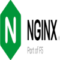
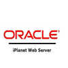

# Deliverable 1 Submission

> Tutorial can be found [here](https://www.digitalocean.com/community/tutorials/how-to-install-the-apache-web-server-on-ubuntu-22-04)

## What is a web server? Hardware and software side
* On the hardware side, a web server is a computer that stores web server software and a website's component files. The web server is also responsible for physical data interchanging with other devices connected to the web.
* On the software side, a web server includes several parts that control how web users access hosted files. An example would be an HTTP server which is software that understands URLs (web addresses) and HTTP (the protocol your browser uses to view webpages).
## What are some different web server applications?

### Apache

Developed by Apache Software Foundation, it is a free and open source web server for Windows, Mac OS X, Unix, Linux, Solaris and other operating systems; it needs the Apache license.

### Ngnix

Popular open source web server for administrators because of its light resource utilization and scalability. It can handle many concurrent sessions due to its event-driven architecture. Nginx also can be used as a proxy server and load balancer.

### Oracle iPlanet Web Server

Oracle iPlanet Web Server is a web server designed for medium and large business applications. It is primarily designed to provide access to your business HTML files.
## What is virtualization?
Virtualization allows users to create virtual representations of servers, storage, network, and other physical machines. This can be achieved by using a software on a computer. Virtualization enables more efficient utilization of physical computer hardware and allows a greater return on an organization’s hardware investment. It is also the foundation of cloud computing.
## What is virtualbox?

VirtualBox is a powerful x86 and AMD64/Intel64 virtualization product for enterprise as well as home use. Not only is VirtualBox an extremely feature rich, high performance product for enterprise customers, it is also the only professional solution that is freely available as Open Source Software under the terms of the GNU General Public License (GPL) version 3.
## What is a virtual machine?
A Virtual Machine (VM) is a compute resource that uses software instead of a physical computer to run programs and deploy apps. One or more virtual “guest” machines run on a physical “host” machine.  Each virtual machine runs its own operating system and functions separately from the other VMs, even when they are all running on the same host. This means that, for example, a virtual MacOS virtual machine can run on a physical PC.
## What is Ubuntu Server?
Ubuntu Server is a server operating system, developed by Canonical and open source programmers around the world, that works with nearly any hardware or virtualization platform. It can serve up websites, file shares, and containers, as well as expand your company offerings with an incredible cloud presence.
## What is a firewall?
A firewall is a computer network security system that restricts internet traffic in, out, or within a private network. It does this by selectively blocking or allowing certain data packets. It is typically intended to prevent anyone from engaging in unauthorized web activities and to help prevent malicious activity.

## What is SSH?
Also known as Secure Shell or Secure Socket Shell, is a network protocol that gives users a secure way to access a computer over an unsecured network. It also refers to the suite of utilities that implement the SSH protocol. It proves a strong password authentication and public key authentication, as well as encrypted data communications between two computers connecting over an open network, such as the internet.

## Concepts I don't understand
* **UFW** - Stands for Uncomplicated Firewall is a user-friendly interface implemented on top of iptables. It provides a simple way to configure a firewall.
* **SSL** - A standard security technology for establishing an encrypted link between a server and a client.
* **init** - Short for "initialization" and it is the first process started during booting of a Unix-like operating system. It is a daemon process which runs in the background until the system shuts down.
* **systemd** - A suite of basic building blocks for a Linux system. It provides a system, service manager and starts the system.
* **systemctl** - A command that manages both system and services configurations, enabling administrators to manage the OS and control the status of services. It is useful for troubleshooting and basic performance tuning. 
* **umask** - User file-creation mode mask (umask) is used to determine the file permission for newly created files. It can be used to control the default file permission for new files. It is a four-digit octal number.
* **nano** - GNU nano is a small editor on the terminal.
* **a2ensite** - A script that enables the specified site (which contains a VirtualHost block) within the apache2 configuration.