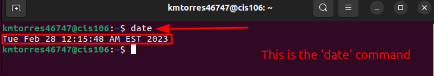

# Lab 3 Submission

## Question 1
Required no submission.

## Question 2

## Question 3

| Program purpose     | Package Name     | Version            |
| ------------------- | ---------------- | ------------------ |
| Play a tetris game  | blockattack      | 2.7.0-1            |
| Play a video file   | dragonplayer     | 4:21.12.3-0ubuntu1 |
| Browse the internet | epiphany-browser | 42.4-0ubuntu1      |
| Read your email     | geary            | 40.0-2             |
| Play music          | lollypop         | 1.4.33-1           |

## Question 4

| command | what it does                                                                                                                      |
| ------- | --------------------------------------------------------------------------------------------------------------------------------- |
| echo    | displays text.                                                                                                                    |
| fortune | generates a random phrase or quote                                                                                                |
| cowsay  | generates an ASCII art of a cow saying based on user input.                                                                       |
| lolcat  | adds random rainbow colors to text.                                                                                               |
| figlet  | displays large characters using ordinary characters.                                                                              |
| toilet  | displays large characters using ordinary characters; however, style is different from figlet.                                      |
| rig     | generates a random identity, provides a first name, last name, street num‐ ber and address, city, state, ZIP code, and area code. |
