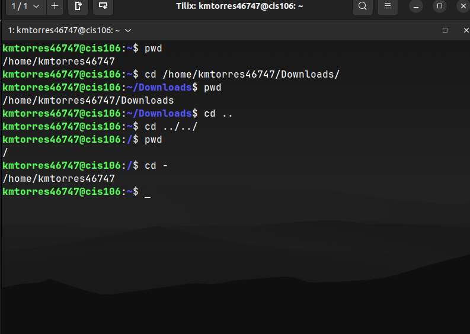

# Week Report 4

## Practice from the presentation The Linux File system:
### Practice 1
 
### Practice 2
 
 
### Practice 3
 
 
## The Linux File system directories and their purpose:

 
 
 

## All the commands for navigating the filesystem 

| Command | What it does               | Syntax                          | Example        |
| ------- | -------------------------- | ------------------------------- | -------------- |
| pwd     | Prints current directory   | pwd                             | `pwd`          |
| cd      | Changes directory          | cd + destination                | `cd Downloads` |
| ls      | Lists files of a directory | ls + option + directory to list | `ls -a`        |

## Basic terminology 

* **File system:** The way files are stored and organized.
* **Current directory:** The directory where you are at the moment.
* **parent directory:** Directory containing the current directory.
* **the difference between your home directory and the home directory:** "Your home directory" refers to the user's home directory. "The home directory" refers to the home directory located in the root.
* **pathname:** Indicates the location of the file in the filesystem.
* **relative path:** Location of a file starting from the current working directory or a directory that is located inside the current working directory.
* **absolute path:** Location of a file starting from the root of the file system.
