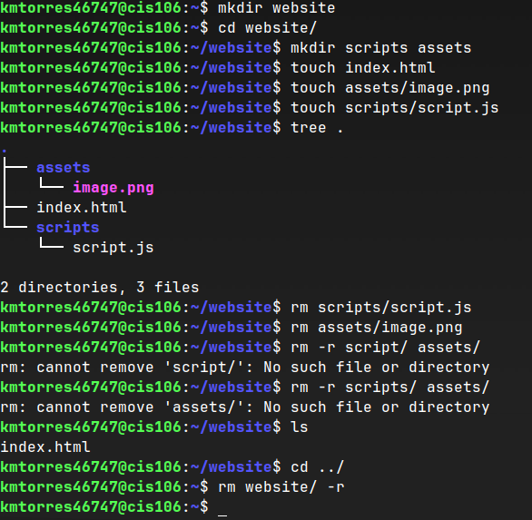
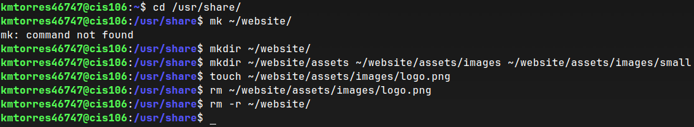
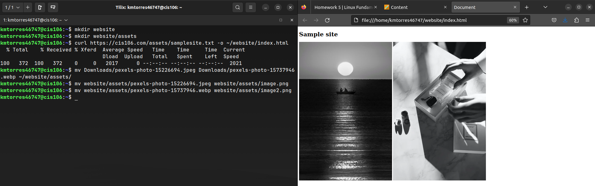
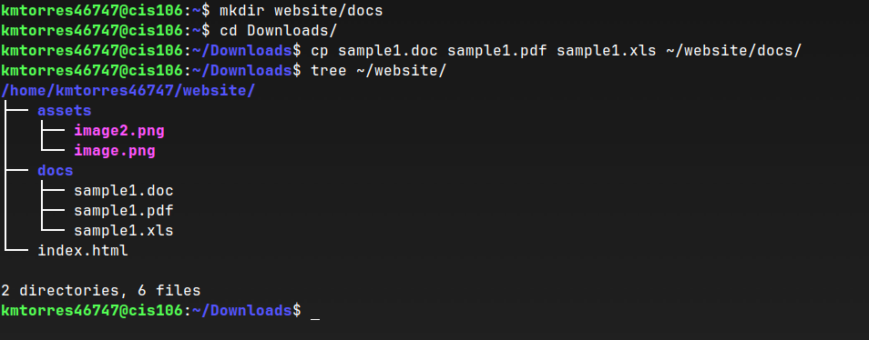

# Week Report 5

## Answer to questions:

* **What are Command Options?**
Commands that modify/enhance their behavior. 
Ex: `command -option argument`
* **What are Command Arguments?**
Commands which are the items open which the command acts on. 
Ex: `ls -l ~/Downloads`
* **Which command is used for creating directories? Provide at least 3 examples.**
The command is mkdir.
* example 1:
  * Create a directory: `mkdir newdir`
* example 2:
  * Create multiple directories: `mkdir faves ~/Downloads/samples ~/Documents/taxes`
* example 3:
  * Create a directory with a space in the name: `mkdir wallpapers/new\ cars`
* **What does the touch command do? Provide at least 3 examples.**
The touch command updates the access and modification times of each FILE to the current time but it is also used to create files if it does not exist.
* example 1:
  * Create a file called cat: `touch cat.pdf`
* example 2:
  * Create several files: `touch program.py lol.exe octopus.gif`
* example 3:
  * Create a file with a space in its name: `touch "re4r completionist guide.html"`
* **How do you remove a file? Provide an example.**
To remove a file, use the rm command. Example: `rm game.exe`
* **How do you remove a directory and can you remove non-empty directories in Linux? Provide an example**
  To remove a directory use the rmdir command. You can remove a non-empty directory ONLY using the `rm -r` command in Linux. Example: `rm -r cheatsheets`
* **Explain the mv and cp command. Provide at least 2 examples of each**
The mv command moves and renames directories.
* example 1:
  * To rename a file: `mv schedule.xlsx kylet_sched.xlsx`
* example 2:
  * To move a file: `mv ~/Downloads/cheatsheet.png ~/Documents/cheatsheet.png`

The cp command copies files/directories from a source to a destination.
* example 1:
  * To copy a file: `cp ~/Downloads/games.zip ~/Games/`
* example 2:
  * To copy multiple files in a single command: `sudo cp -r home.html page1.html style.css ~/hw/`
## Practice 1
 
## Practice 2
 
## Practice 3
 
## Practice 4
 