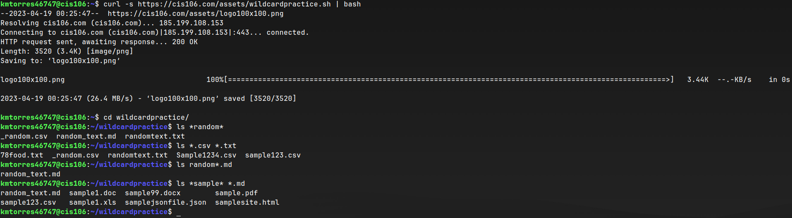
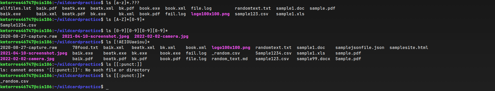

# Week Report 6

### Wildcards

### * Wildcard
The * wildcard matches from 0 to any number of characters.
* Examples:
  * List all .doc files.
    * `ls *.doc`
  * List files that have any character before and after the string "test."
    * `ls *test.*`
  * List files that start with the string "movie" regardless of their extension.
    * `ls movie.*`
### ? Wildcard
The ? wildcard matches precisely one character.
* Examples:
  * List all hidden files in the current directory.
    * `ls ./.??*`
  * List all files that have two characters between the letters f and e.
    * `ls f??e*`
  * List all files with a three letter extension
    * `ls *.???`
### [] Wildcard
The [] wildcard match a single character in a range.
* Examples:
  * Match all files that do not have a vowel after f
    * `ls f[!aeiou]`
  * Match all files whose name has at least one number.
    * `ls *[0-9].*`
  * Match all files whose name begins with a letter from a-e or start with letters t or x:
    * `ls [a-etx]*`

### Brace Expansion
Not a wild card but, allows you to generate arbitrary string to use with commands.
* Examples:
  * Create a whole direction structure in a single command
    * `mkdir -p music/{jazz,rock}/{mp3files,videos,raw}/new{1..3}`
  * Remove multiple files in a single directory
    * `rm -r {dir1,dir2,dir3,file.txt,file.py}`
  * Create multiple files
    * `touch file{1..10}.txt`
## Practices

### Practice 5

### Practice 6

### Practice 7
